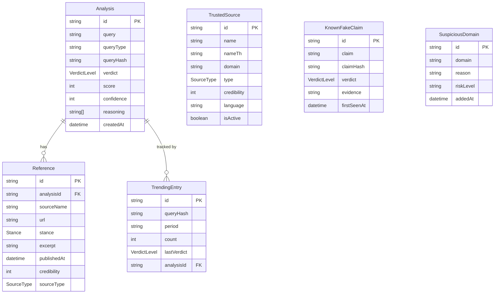

# Data Schema — ชัวร์ก่อนแชร์

## 1. PostgreSQL (Prisma)

### Prisma Schema

```prisma
// prisma/schema.prisma

generator client {
  provider = "prisma-client-js"
}

datasource db {
  provider = "postgresql"
  url      = env("DATABASE_URL")
}

enum VerdictLevel {
  DANGEROUS    // 0-20
  SUSPICIOUS   // 21-40
  UNCERTAIN    // 41-60
  LIKELY_TRUE  // 61-80
  VERIFIED     // 81-100
}

enum Stance {
  SUPPORTING
  OPPOSING
  NEUTRAL
}

enum SourceType {
  TRUSTED_MEDIA
  FACT_CHECKER
  ACADEMIC
  GOV
  UNKNOWN
}

model Analysis {
  id          String       @id @default(cuid())
  query       String       // raw input text, url, or "image:<filename>"
  queryType   String       // "text" | "url" | "image"
  queryHash   String       // SHA-256 of normalized query (for trending dedup)
  verdict     VerdictLevel
  score       Int          // 0-100
  confidence  Int          // 0-100 AI confidence
  reasoning   String[]     // array of Thai bullet points
  createdAt   DateTime     @default(now())

  references  Reference[]
  trending    TrendingEntry[]

  @@index([queryHash])
  @@index([createdAt])
}

model Reference {
  id            String     @id @default(cuid())
  analysisId    String
  sourceName    String
  url           String
  stance        Stance
  excerpt       String     // max 200 chars
  publishedAt   DateTime?
  credibility   Int        // 0-100
  sourceType    SourceType

  analysis      Analysis   @relation(fields: [analysisId], references: [id], onDelete: Cascade)

  @@index([analysisId])
}

model TrustedSource {
  id          String     @id @default(cuid())
  name        String
  nameTh      String?
  domain      String     @unique
  type        SourceType
  credibility Int        // 0-100
  language    String     // "th" | "en" | "both"
  isActive    Boolean    @default(true)
  createdAt   DateTime   @default(now())
}

model KnownFakeClaim {
  id          String   @id @default(cuid())
  claim       String
  claimHash   String   @unique // SHA-256 of normalized claim
  verdict     VerdictLevel
  evidence    String   // explanation in Thai
  firstSeenAt DateTime
  createdAt   DateTime @default(now())

  @@index([claimHash])
}

model SuspiciousDomain {
  id        String   @id @default(cuid())
  domain    String   @unique
  reason    String   // Thai explanation
  riskLevel String   // "high" | "medium"
  addedAt   DateTime @default(now())
}

model TrendingEntry {
  id          String       @id @default(cuid())
  queryHash   String
  period      String       // "day" | "week" | "month"
  count       Int          @default(1)
  lastVerdict VerdictLevel
  updatedAt   DateTime     @updatedAt
  analysisId  String?

  analysis    Analysis?    @relation(fields: [analysisId], references: [id], onDelete: SetNull)

  @@unique([queryHash, period])
  @@index([period, count])
}
```

---

### Mermaid ERD



---

### Seed Data

#### TrustedSources (20+ entries)

| name | nameTh | domain | type | credibility | language |
|------|--------|--------|------|-------------|----------|
| Thairath | ไทยรัฐ | thairath.co.th | TRUSTED_MEDIA | 80 | th |
| Matichon | มติชน | matichon.co.th | TRUSTED_MEDIA | 82 | th |
| Prachachat | ประชาชาติ | prachachat.net | TRUSTED_MEDIA | 78 | th |
| Thai PBS | ไทยพีบีเอส | thaipbs.or.th | TRUSTED_MEDIA | 90 | th |
| Khao Sod | ข่าวสด | khaosod.co.th | TRUSTED_MEDIA | 76 | th |
| Post Today | โพสต์ทูเดย์ | posttoday.com | TRUSTED_MEDIA | 75 | th |
| Nation Thailand | เนชั่นไทย | nationthailand.com | TRUSTED_MEDIA | 77 | both |
| AFP Fact Check TH | AFP ตรวจสอบข้อเท็จจริง | factcheck.afp.com/th | FACT_CHECKER | 95 | both |
| Anti-Fake News Center | ศูนย์ต่อต้านข่าวปลอม | antifakenewscenter.com | GOV | 88 | th |
| Sure And Share | ชัวร์ก่อนแชร์ | sure.co.th | FACT_CHECKER | 85 | th |
| Cofact Thailand | โคแฟกต์ | cofact.org | FACT_CHECKER | 83 | th |
| Fact Check Thailand | แฟกต์เช็คไทยแลนด์ | factcheckthai.com | FACT_CHECKER | 80 | th |
| BBC News Thai | บีบีซีไทย | bbc.com/thai | TRUSTED_MEDIA | 95 | both |
| BBC News | BBC | bbc.com | TRUSTED_MEDIA | 97 | en |
| Reuters | รอยเตอร์ส | reuters.com | TRUSTED_MEDIA | 97 | en |
| AP News | เอพี | apnews.com | TRUSTED_MEDIA | 96 | en |
| Snopes | สโนปส์ | snopes.com | FACT_CHECKER | 92 | en |
| FactCheck.org | แฟกต์เช็ค | factcheck.org | FACT_CHECKER | 94 | en |
| PolitiFact | โพลิติแฟกต์ | politifact.com | FACT_CHECKER | 90 | en |
| Full Fact | ฟูลแฟกต์ | fullfact.org | FACT_CHECKER | 89 | en |
| WHO | องค์การอนามัยโลก | who.int | GOV | 93 | en |
| Ministry of Public Health TH | กระทรวงสาธารณสุข | moph.go.th | GOV | 85 | th |

#### KnownFakeClaims (10+ entries)

| claim (abbreviated) | verdict | evidence |
|---------------------|---------|----------|
| "ดื่มน้ำร้อนฆ่าไวรัสโคโรนาได้" | DANGEROUS | WHO ยืนยันว่าการดื่มน้ำร้อนไม่สามารถฆ่าไวรัสโคโรนาได้ |
| "วัคซีนโควิดมีชิปติดตาม 5G" | DANGEROUS | ไม่มีหลักฐานทางวิทยาศาสตร์ใดสนับสนุน |
| "กินกระเทียมป้องกันโควิดได้" | SUSPICIOUS | WHO ระบุไม่มีหลักฐานว่ากระเทียมป้องกันโควิดได้ |
| "น้ำยาบ้วนปากฆ่าไวรัสโควิดในลำคอ" | SUSPICIOUS | ยังไม่มีหลักฐานเพียงพอ |
| "โควิดสร้างขึ้นในห้องทดลองจีน" | UNCERTAIN | หน่วยงานข่าวกรองยังมีความเห็นแตกต่างกัน |
| "ไทยค้นพบยารักษาโควิดจากฟ้าทะลายโจย" | SUSPICIOUS | กรมการแพทย์ระบุยังอยู่ในขั้นทดลอง |
| "บิล เกตส์ปล่อยโควิดเพื่อขายวัคซีน" | DANGEROUS | ไม่มีหลักฐานใด ๆ และผิดข้อเท็จจริงโดยสิ้นเชิง |
| "รัฐบาลซ่อนตัวเลขผู้ติดเชื้อจริง" | UNCERTAIN | ยังไม่มีหลักฐานเพียงพอ |
| "แอลกอฮอล์ฉีดเข้าเส้นฆ่าโควิดได้" | DANGEROUS | อันตรายถึงชีวิต ไม่มีผลป้องกันไวรัส |
| "ยุงเป็นพาหะนำโรคโควิด" | DANGEROUS | WHO ยืนยันโควิดไม่แพร่ผ่านยุง |
| "นม UHT ทำให้ภูมิคุ้มกันต่ำ" | SUSPICIOUS | ไม่มีหลักฐานทางการแพทย์รองรับ |

#### SuspiciousDomains (10+ entries)

| domain | reason | riskLevel |
|--------|--------|-----------|
| news-fake-th.com | ไม่มีการลงทะเบียนสื่อ ข้อมูล WHOIS ซ่อน | high |
| thairath-news.net | ปลอมแปลงชื่อใกล้เคียงสื่อจริง | high |
| breaking-thailand.info | ไม่มีบรรณาธิการ เผยแพร่ข่าวปลอมซ้ำ | high |
| covid-cure-thai.com | เว็บไซต์รักษาโรคปลอม | high |
| thai-viral-news.xyz | โดเมน .xyz ไม่น่าเชื่อถือ ไม่มี SSL | high |
| linetoday-fake.com | ปลอมแปลง LINE Today | high |
| thaigov-news.net | แอบอ้างเป็นรัฐบาลไทย | high |
| healthnews-th.info | ข่าวสุขภาพปลอม ไม่อ้างอิงแหล่ง | medium |
| viral-share-th.com | เว็บรวมข่าวไม่ตรวจสอบข้อเท็จจริง | medium |
| clickbait-news.asia | เนื้อหาหลอกคลิก ไม่มีหลักฐาน | medium |
| rumors-thailand.net | เผยแพร่ข่าวลือโดยไม่ตรวจสอบ | medium |

---

## 2. localStorage Schema

### Key: `snbs_history`

Stores an array of `HistoryItem` objects. Maximum 100 entries. When the limit is exceeded, the oldest entry (lowest `createdAt`) is automatically removed.

```typescript
interface HistoryItem {
  id: string;                    // nanoid() — unique per check
  queryType: 'text' | 'url' | 'image';
  queryPreview: string;          // truncated to 100 chars for display
  query: string;                 // full query (text/url) or filename (image)
  verdict: VerdictLevel;         // 'DANGEROUS' | 'SUSPICIOUS' | 'UNCERTAIN' | 'LIKELY_TRUE' | 'VERIFIED'
  score: number;                 // 0-100
  confidence: number;            // 0-100
  analysisId: string;            // server-side Analysis.id for fetching full result
  createdAt: string;             // ISO 8601 datetime
}

type VerdictLevel = 'DANGEROUS' | 'SUSPICIOUS' | 'UNCERTAIN' | 'LIKELY_TRUE' | 'VERIFIED';
```

### Key: `snbs_lang`

```typescript
type Language = 'th' | 'en';     // default: 'th'
```

### Export/Import Format

```typescript
interface HistoryExport {
  version: '1.0';
  exported_at: string;           // ISO 8601
  items: HistoryItem[];
}
```

**Import rules:**
- Merge with existing history (union by `id`, no duplicates)
- After merge, enforce 100-entry limit (remove oldest)
- Validate schema before importing; display Thai error if invalid format

### Storage Limits

| Key | Type | Max Size | Eviction |
|-----|------|----------|----------|
| `snbs_history` | `HistoryItem[]` | 100 items | Oldest by `createdAt` |
| `snbs_lang` | `'th' \| 'en'` | 1 value | Manual only |
